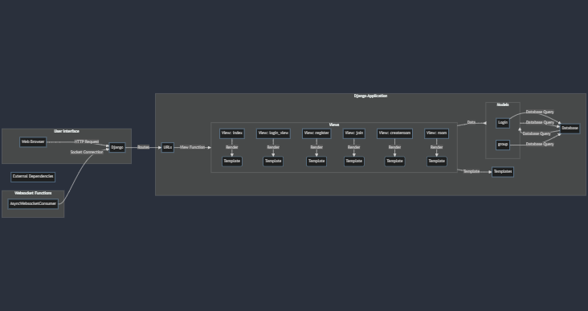

# Developer Documentation: Raise Hand System

## Table of Contents
1. [Introduction](#1-introduction)
2. [Technical Specifications](#2-technical-specifications)
3. [Architecture Overview](#3-architecture-overview)
   - [3.1 System Components](#31-system-components)
   - [3.2 Workflow Diagram](#32-workflow-diagram)
4. [Installation and Setup](#4-installation-and-setup)
5. [Usage](#5-usage)
6. [Integration with Django Channels](#6-integration-with-django-channels)
7. [Testing](#7-testing)
8. [Deployment](#8-deployment)
9. [Performance](#9-performance)
10. [Security Considerations](#10-security-considerations)
11. [Troubleshooting](#11-troubleshooting)
12. [Future Improvements](#12-future-improvements)
13. [Contributing](#13-contributing)
14. [License](#14-license)

---

## 1. Introduction
This document provides a detailed guide for developers working on the Raise Hand System. Built with Django and Django Channels, the system allows students in both physical and virtual classrooms to signal their need for assistance. This enhances interaction and facilitates orderly communication.

---

## 2. Technical Specifications
- **Frameworks**:
  - Django 3.x
  - Django Channels 3.x
- **Dependencies**:
  - Channel_redis
- **Database**:
  - SQLite
---

## 3. Architecture Overview
### 3.1 System Components
The system consists of:
- **Django Backend**: Handles authentication, database operations, and core business logic.
- **Django Channels**: Manages WebSocket communication for real-time interactions.
- **Channel_redis**: Serves as the messaging backend, facilitating communication across instances.

### 3.2 Workflow Diagram


---

## 4. Installation and Setup
Follow these steps to set up the Raise Hand System locally:
1. Clone the repository:
   ```
   git clone https://github.com/RashedAsaad1/RaiseHandSystem.git
   ```
2. Navigate to the project directory:
   ```
   cd RaiseHandSystem
   ```
3. Install required dependencies:
   ```
   pip install -r requirements.txt
   ```
4. Configure the Django settings (database and secret key).
5. Create an administrative account:
   ```
   python manage.py createsuperuser
   ```
6. Apply database migrations:
   ```
   python manage.py migrate
   ```
7. Launch the development server:
   ```
   python manage.py runserver
   ```

---

## 5. Usage
With the system set up, users can log in to raise or lower their hands, and instructors can view and manage the queue of raised hands in real-time via the user interface.

---

## 6. Integration with Django Channels
Integrate Django Channels by setting up routes and consumers to handle WebSocket connections. Consult the [Django Channels documentation](https://channels.readthedocs.io) for detailed steps.

---

## 7. Testing
Execute automated tests to verify system functionality:
```
python manage.py test
```

---

## 8. Deployment
Deploy the system using cloud platforms like AWS or DigitalOcean. Ensure environment variables are configured securely and utilize security best practices.

---

## 9. Performance
Key performance metrics include WebSocket connection management and message processing speeds. Use tools like Django Debug Toolbar and New Relic for monitoring.

---

## 10. Security Considerations
Implement strong authentication and encryption protocols to ensure secure communication. Regularly update all dependencies to mitigate security vulnerabilities.

---

## 11. Troubleshooting
- **WebSocket Connection Errors**:
  - Ensure WebSocket URLs are correct and check the channel layer configuration.
- **Channel_redis Connection Issues**:
  - Verify the Redis server configuration and ensure connectivity.

---

## 12. Future Improvements
Potential enhancements include:
- Advanced UI/UX features.
- Enhanced security measures and user permission settings.
- Integration with external authentication services.

---

## 13. Contributing
Contributions are encouraged! Fork the repository, make your changes, and submit a pull request. Adhere to the project's coding standards and guidelines.

---

## 14. License
The Raise Hand System is open-sourced under the [MIT License](LICENSE). Use, modify, and distribute it as per the license terms.

